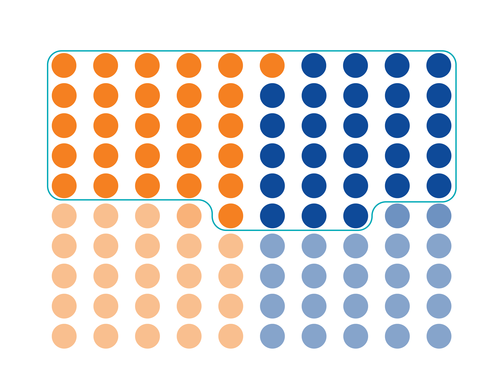
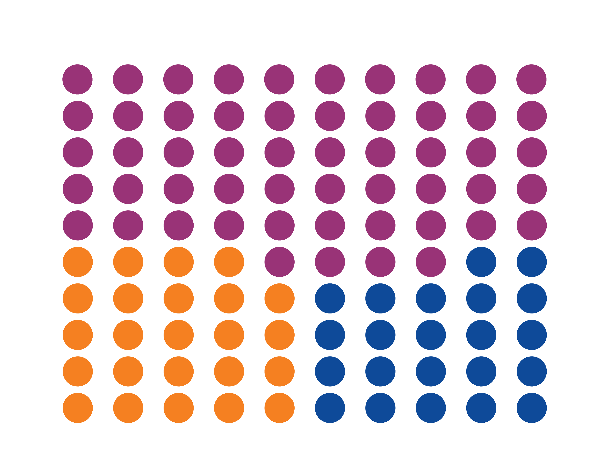
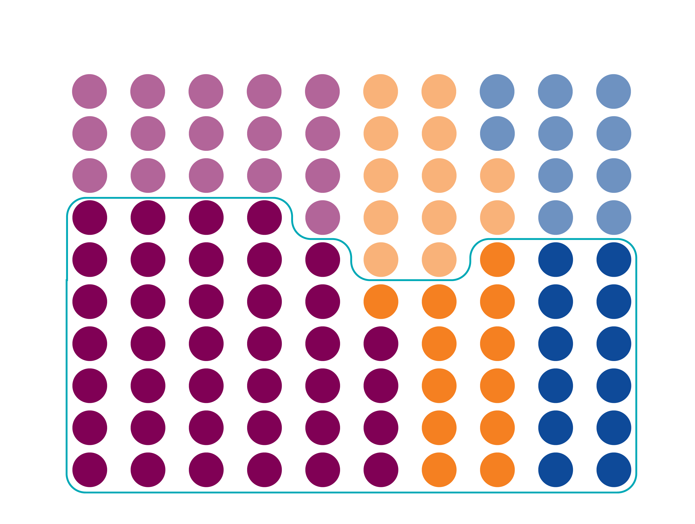
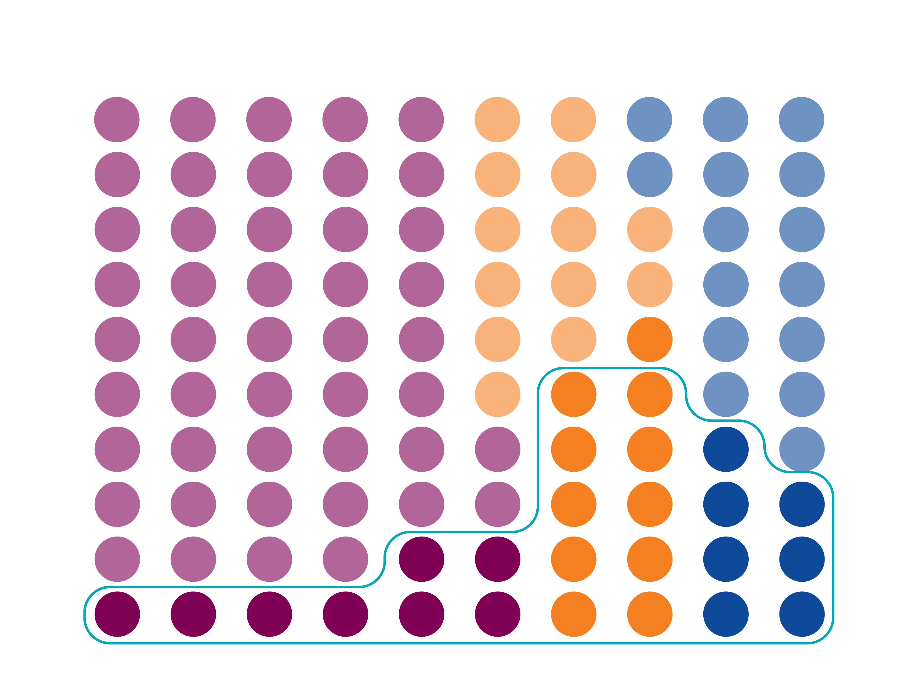
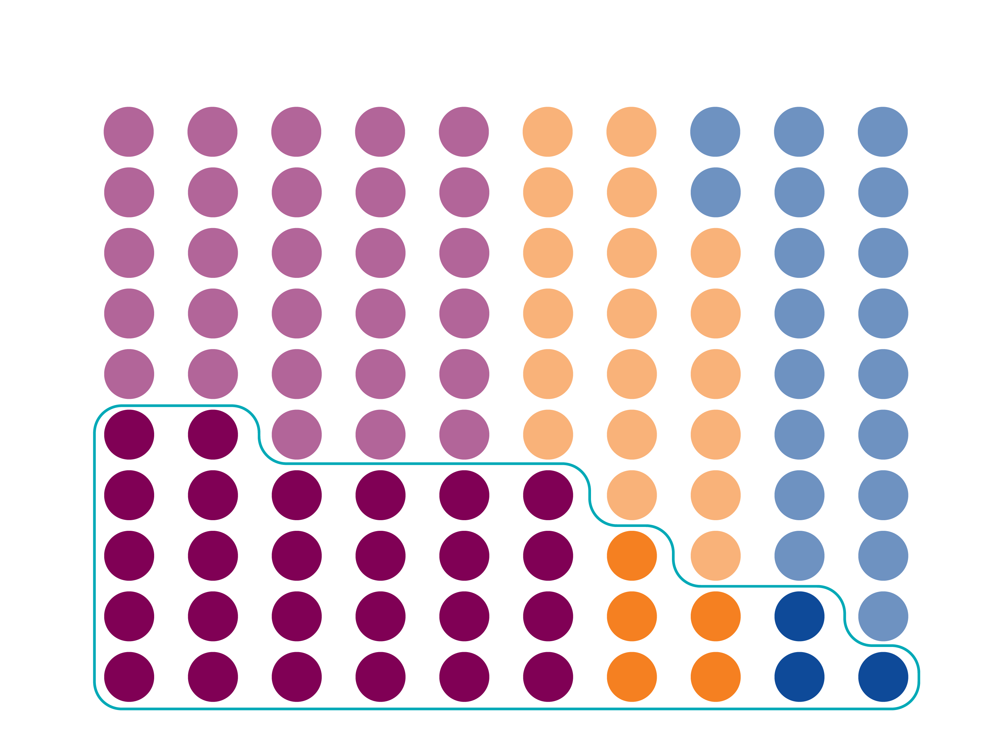

```{r setup, include=FALSE}
knitr::opts_chunk$set(echo = TRUE, warning = FALSE, message = FALSE, 
                      dev.args=list(bg="transparent"), fig.width=16,fig.height=12)


library(glptools)
glp_load_packages(TRUE)
library(arrow)
library(viridis)
library(forcats)
library(hrbrthemes)
library(glpdata)


showtext_auto()
font_add("Museo Sans", "MuseoSans_300.otf")

```

```{r, include=FALSE}
#Overlayed histogram
func_plt_hist_overlay <- function(data, var) {

  data$group <- data[[var]]

  possible_colors <- c("#0E4A99", "#F58021", "#00A9B7", "#800055", "#356E39", "#CFB94C", "#7E9C80")
  number_I_need = length(unique(data$group))
  these_colors <- possible_colors[1:number_I_need]

  p <- data %>% ggplot( aes(x=HHINCOME, fill=group, color = group, weight = HHWT)) +
    geom_histogram(alpha=0.5, position = 'identity', binwidth = 10000) +
    scale_fill_manual(values = these_colors) +
    scale_color_manual(values = these_colors) +

    labs(fill="") +
    xlab("Household Income") +
    ylab("Percentage") 
    
  
  return (p)
  
}

glp_graph_theme <- theme_bw(
    base_size = 8,
    base_family = "Museo Sans")

glp_graph_theme <- glp_graph_theme +
  theme(
    legend.title     = element_blank(),
    legend.position  = "top",
    legend.margin    = margin(t = 10, unit = "pt"),
    legend.spacing.x = unit(30, "pt"),
    legend.text      = element_text(size = 40,
                                    margin = margin(b = 15, t = 15, unit = "pt")),

    axis.text    = element_text(size = 50),
    axis.title   = element_text(size = 60),
    axis.title.x = element_text(margin = margin(t = 15, unit = "pt")),
    axis.title.y = element_text(margin = margin(r = 15, unit = "pt")),

    plot.title = element_text(size = 90,
                              hjust = .5,
                              margin = margin(b = 25, unit = "pt")),

    plot.caption = element_text(size = 40,
                                lineheight = 0.5)) +
    theme(
      panel.background = element_rect(fill = "transparent", color = NA), # bg of the panel
      plot.background = element_rect(fill = "transparent", color = NA), # bg of the plot
      legend.background = element_rect(fill = "transparent", color = "transparent"), # get rid of legend bg
      legend.box.background = element_rect(fill = "transparent", color = "transparent"), # get rid of legend panel bg
      legend.key = element_rect(fill = "transparent",colour = NA)
    )
  
      # theme(plot.subtitle = element_text(hjust = 0.5, size = 50)) +
      # labs(subtitle = subtitle_text)

```

```{r prep_data, eval=FALSE, include=FALSE}
#Skip
# Harrison
#census_data <- read_feather("../../glpdata/data-raw/microdata/acs_micro_repwts.feather")

#Josh
#census_data <- read_feather("/Users/joshmarkwell/Desktop/Professional/GLP/projects/gender_equity/raw_data/acs_micro_repwts.feather")


census_data %<>%
  filter(FIPS == "21111")

write_feather(census_data, "raw_data/census_data.feather")


save(population_tract, file = "raw_data/tract_population.RData")

```


```{r read in new data, eval=FALSE, include=FALSE}
#Skip - only use if changing data to include

#acs_micro_8_11_22 <- read_feather("raw_data/acs_micro_FIPS_repwts_8_11_22.feather") 

census_data %<>%
  filter(FIPS == "21111" | FIPS == '37081')


write_feather(census_data, "raw_data/census_data_8_11_22.feather")

```


```{r explore new data, include=FALSE}
#Start
#File for use below
census_microdata081122_person <- read_feather("raw_data/census_data_8_11_22.feather") 

```
  

```{r clean data, include= FALSE}
# To classify the housing data into homeowners, renters, cost-bu
#also create income brackets, earner types
if ("census_microdata081122_processed.feather" %in% list.files("raw_data")) {
  census_microdata081122 <- arrow::read_feather("raw_data/census_microdata081122_processed.feather")
  census_microdata081122_person <- arrow::read_feather("raw_data/census_microdata081122_person_processed.feather")
} else {
  
  census_microdata081122_person %<>%
    group_by(year, SERIAL) %>%
    mutate(hh_members = n()) %>%
    ungroup() %>%
    #filter(PERNUM == 1) %>%
    mutate(
      OWNCOST  = replace(OWNCOST, OWNCOST == 99999, NA),
      HHINCOME = replace(HHINCOME, HHINCOME == 99999, NA),
      INCTOT = replace(INCTOT, INCTOT == 9999999, NA),
      OWNERSHP = replace(OWNERSHP, OWNERSHP == 0, NA),
      RENTGRS  = replace(RENTGRS, RENTGRS == 0 & OWNERSHP == 1, NA),
  
      homeownership = if_else(OWNERSHP == 1, T, F),
  
      hcost = if_else(homeownership == 1, OWNCOST, RENTGRS),
      cost_burden = if_else(hcost * 12 / HHINCOME > 0.3, T, F),
      severe_cost_burden = if_else(hcost * 12 / HHINCOME > 0.5, 1, 0),
  
      hh_type = case_when(
        homeownership  & !cost_burden ~ "noncb_homeowner",
        homeownership  & cost_burden  ~ "cb_homeowner",
        !homeownership & !cost_burden ~ "noncb_renter",
        !homeownership & cost_burden  ~ "cb_renter",
        TRUE ~ NA_character_),
      
      KITCHEN  = replace(KITCHEN, KITCHEN == 0, NA),
      ROOMS    = replace(ROOMS, ROOMS == 0, NA),
      PLUMBING = replace(PLUMBING, PLUMBING == 0, NA),
  
      severe_housing_problems = if_else(
        KITCHEN == 1 | PLUMBING == 10 | hh_members / ROOMS > 1 | severe_cost_burden, T, F),
      
  #income brackets based on HHINCOME
    #LH-Lower half -> lower40% 
    #UH-Upper Half -> 40th to 80th 
    #T20 -> top 20th percentile
  
      
    income_group = case_when(
      HHINCOME <= quantile(HHINCOME, probs = 0.4) ~ 'LH',
      HHINCOME <= quantile(HHINCOME, probs = 0.8) ~ 'UH',
      HHINCOME > quantile(HHINCOME, probs = 0.8) ~ 'T20',
      TRUE ~ NA_character_),
  
      age_group = case_when(
        age %in% 15:19 ~ NA_character_, 
        age %in% 20:29 ~ "20-29", 
        age %in% 30:39 ~ "30-39",  
        age %in% 40:49 ~ "40-49",  
        age %in% 50:59 ~ "50-59",  
        age %in% 60:69 ~ "60-69", 
        age %in% 70:79 ~ "70-79", 
        age >= 80 ~ "80+")) %>%
    
    group_by(year, SERIAL) %>%
    mutate(
      earner_type = case_when(
        HHINCOME == 0 ~ 'no_earnings',
        any(INCTOT >= 0.95 * HHINCOME) ~ 'single_earner',
        TRUE ~ 'multiple_earner'),
  
      earner_type_d = case_when(
        sex == 'female' & earner_type == 'single_earner' ~ 'single_fem_earner',
        sex == 'male' & earner_type == 'single_earner' ~ 'single_male_earner',
        earner_type == 'multiple_earner' ~ 'multiple_earner'),
        
        num_children = sum(age < 18),
      
        any_kd_pres = if_else(num_children > 0, "kids", "no_kids"),
      
        own_kd_pres = if_else(NCHILD > 0, "kids", "no_kids"),
      
        kd_pres = any_kd_pres == "kids" | own_kd_pres == "kids") %>%
    ungroup()
  
  
  census_microdata081122_person %<>% filter(!is.na(age_group))
  
  census_microdata081122 <- census_microdata081122_person %>%
    filter((earner_type == "single_earner" & INCTOT >= 0.95 * HHINCOME) | 
             (earner_type == "multiple_earner" & PERNUM == 1))
  
  arrow::write_feather(census_microdata081122, "raw_data/census_microdata081122_processed.feather")
  arrow::write_feather(census_microdata081122_person, "raw_data/census_microdata081122_person_processed.feather")
}

  
```

``` {r louisville 2019 data, include = FALSE}


lville_2019 <- census_microdata081122 %>% 
  filter(FIPS == '21111',
         year == '2019')

cost_burden_age_sf <- census_microdata081122 %>% 
    filter(year %in% 2017:2019) %>%
  mutate(
    cost_burden = factor(cost_burden, 
                         levels = rev(c(TRUE, FALSE)), 
                         labels = rev(c("Cost Burdened", "Non Cost Burdened")), 
                         ordered = TRUE)
    )


```


```{r}


# Inctest = HHINCOME *0.95
# 
# Single_earner_1 = INCTOT >= INCTEST
# single_earner_2 = any(Single_earner_1)

# new_df <- lville_2019 %>%
#   mutate(
#   
#   earner_var = if_else(HHINCOME <= (0.95*INCTOT) , "single_earner", "multi_earner")
#   )
# 
#   
#     earner_var = case_when(
#     HHINCOME == 0 ~ 'no_earnings',
#     INCTOT >= 0.65 * HHINCOME ~ "single_earner",
#     TRUE ~ "multi_earner"
#     )
#   )


      # earner_type = case_when(
      #   HHINCOME == 0 ~ 'no_earnings',
      #   any(INCTOT >= 0.90 * HHINCOME) ~ 'single_earner',
      #   TRUE ~ 'multi_earner'
```


```{r Saves Survey By Demographic Data Frames, include=FALSE, eval=FALSE}

# Data frame with all demographics
# Variable: homeownership
H_gender <- survey_by_demog(census_microdata081122, weight_var = "HHWT", 'homeownership')

# Data frame broken out by earner type rather than male/female
# Variable: homeownership
H_earntype_race <- census_microdata081122 %>%
  group_by(FIPS, year, race, earner_type_d) %>%
  summarize(homeownership = sum(HHWT[homeownership]) / sum(HHWT) * 100, .groups = "drop")

H_earntype  <- census_microdata081122 %>%
  group_by(FIPS, year, earner_type_d) %>%
  summarize(homeownership = sum(HHWT[homeownership]) / sum(HHWT) * 100, .groups = "drop") %>%
  mutate(race = "total")

H_earntype %<>%
  bind_rows(H_earntype_race) %>%
  select(FIPS, year, race, earner_type_d, homeownership)

rm(H_earntype_race)

# Data frame broken out by earner type and presence of children
# Variable: homeownership
H_earntype_kids <- census_microdata081122 %>%
  filter(earner_type == 'single_earner') %>%
  survey_by_demog( weight_var = "HHWT", 'homeownership', other_grouping_vars = c("kd_pres"))

# Data frame broken out by earner type and presence of children
# Variable: cost_burden
CB_earntype_race <- census_microdata081122 %>%
  group_by(FIPS, year, race, earner_type_d) %>%
  summarize(cost_burden = sum(HHWT[cost_burden]) / sum(HHWT) * 100, .groups = "drop")

CB_earntype  <- census_microdata081122 %>%
  group_by(FIPS, year, earner_type_d) %>%
  summarize(cost_burden = sum(HHWT[cost_burden]) / sum(HHWT) * 100, .groups = "drop") %>%
  mutate(race = "total")

CB_earntype %<>%
  bind_rows(CB_earntype_race) %>%
  select(FIPS, year, race, earner_type_d, cost_burden)

rm(CB_earntype_race)

save(H_gender, H_earntype, H_earntype_kids, CB_earntype, 
     file = "clean_svybydemog_data.RData")
```

```{r}
load("clean_svybydemog_data.RData")
```

# Introduction

Access to safe and affordable housing is foundational for families' well-being. In this report, we examine the intersection between gender and housing. We find that while in Louisville, women and men have similar rates of homeowership, women are far more likely to live in housing that is not affordable to them. This is exacerbated for women from a single-income home, women with children, and women of color. Disproportionate cost of living burdens and care-taking responsibilities can perpetuate a viscous cycle of inequity. Understanding the true size of the 'equity gap' can help inform policy decisions to stop this cycle from continuing.  

### Key Definitions

* **Cost-burdened household** - when a household pays more than *30%* of their income toward housing costs (including rent, utilities, mortgage payments, and any other homeownership costs). This is a standard cutoff for "affordability."
* **Severely cost-burdened household** - when a household has to pay more than *50%* of their income toward housing costs.
* **Single-earner household** and **Multiple-earner household** - A single-income household has only one wage earner, while a multiple-earner household includes multiple earners. Throughout the data, we usually group households into three groups:
  + Multiple-earner households
  + Single-earner, female-headed households
  + Single-earner, male-headed households
* **Households with Children** include any households with children under age 18. The Census Bureau collects information on whether household members are related, but this data does not encompass all living situations, particularly people raising children who are not legally related to them. We assume that adults are responsible for the care of any children living in their household. While this is likely complicated in large households with multiple adults and families, all of our analysis that includes children focuses on households with a single income-earner, so we are confident that this assumption reflects their reality in most cases.
  
The fact that a household falls under the single-earner category reflects their financial situation rather than the personal relationships of the people within the household. Single-earner households might include someone living on their own or living with children, or they might have a spouse or partner who is not working or who lives outside the household.

### Key Takeaways

1. Women and men in single-income households have very **similar rates of homeownership** in Louisville. 
2. On average, women in single-income households make **significantly less money** than men from single-income households. As a result, almost half of Louisville women in single-income households are **cost-burdened**, putting them at increased risk of eviction or foreclosure.
3. Around **39% of women in single-income households earn a living wage** that covers their basic expenses. Single-earner women without children are most likely to earn a living wage. Only around 1 in 4 single-income women with one child, 1 in 20 single-income women with two children, and 1 in 50  single-income women with three children earn a living wage.
4. Compared to peer cities, Louisville has **relatively high homeownership for women in single-income households with no children**. However, **for single-income women with children, we are second to last**. Additionally, homeownership for women from a one-income household with children has been steadily decreasing since 2016. 
5. Homeownership for single-income women is **much lower** for women of color.

### Other Notes

* This data comes from the *U.S. Census Bureau American Community Survey*, or *ACS* for short. The ACS is the nation's largest annual household survey. Because the data comes from a survey, small changes from year to year might reflect noise in the data due to the random sampling of households from one year to the next. The data becomes even noisier when we look at small groups for whom there were fewer responses (e.g. Black women with children). Small changes from year-to-year should be interpreted with caution. 
* Some graphs include a *rolling mean* that averages multiple years of data together to reduce noise. This is noted on those graphs.
* GLP strives to use inclusive language and analyze data for traditionally underrepresented groups whenever possible. However, current data has its limitations. The terminology we use to describe race, sex, gender, and other identities mirrors the way questions were asked in the U.S. Census Bureau's American Community Survey. Additionally, the survey does not provide us with enough information to create data on many populations in Louisville. When we break data down by race, we include data for white non-Hispanic residents, Black non-Hispanic residents, and Hispanic residents. For the original questionnaire text, see the Appendix section of this report.

# Households and Housing

We'll look at how homeownership and affordability shake out among Louisville residents. We'll represent the 315,000 households as 100 dots.

<h4>Louisville population is <span style="color:#F58021">51% female</span> and <span style="color:#0E4A99">49% male</span>.</h4>

{width=75%}

<h4>Of the 315,000 households in Louisville, <span style="color:#00A9B7">54%</span> receive income from multiple residents.</h4>

{width=75%}

<h4>We’ll call these households <span style="color:#800055">multiple-earner</span> households.</h4>

{width=75%}

<h4>(We'll also rotate things to make it easier to follow.)</h4>

{width=75%}

<h4></h4>

<h4><span style="color:#F58021">71% of multiple-earner households</span> are homeowners.
Only <span style="color:#0E4A99">49% of single female-headed households</span> are homeowners, and 
<span style="color:#800055">55% of single male-headed households</span> are homeowners.</h4>

{width=75%}

<h4><span style="color:#F58021">14% of multiple-earner households</span> are cost-burdened,
<span style="color:#0E4A99">46% of single female-headed households</span> are cost-burdened, and 
<span style="color:#800055">31% of single male headed households</span> are cost-burdened.</h4>

{width=75%}

<h4><span style="color:#F58021">49% of multiple-earner households</span> have children in the household,
<span style="color:#0E4A99">23% of single female-headed households</span> have children in the household, and 
<span style="color:#800055">13% of single male headed households</span> have children in the household.</h4>

{width=75%}

Through the rest of this report, we'll look at how these things combine to affect homeownership and housing affordability.

```{r Harrison, out.width = "100%", out.extra='style="border: 0px" allowfullscreen=""', include=FALSE}

waffle_data <- survey_by_demog(lville_2019, "hh_type", other_grouping_vars = c("kd_pres", "earner_type"))

waf_gender <- waffle_data %>%
  filter(
    race == "total",
    sex != "total",
    var_type == "population") %>%
  group_by(sex) %>%
  summarize(n = sum(cb_homeowner), .groups = "drop") %>%
  mutate(pct = n / sum(n) * 100)

waf_earn_type <- waffle_data %>%
  filter(
    race == "total",
    sex != "total",
    var_type == "population") %>%
  group_by(sex, earner_type)  %>%
  summarize(n = sum(cb_homeowner), .groups = "drop") %>%
  mutate(pct = n / sum(n) * 100)

waf_homeowner <- waffle_data %>%
  filter(
    race == "total",
    sex != "total",
    var_type == "estimate") %>%
  group_by(sex, earner_type)  %>%
  summarize(n = sum(cb_homeowner + noncb_homeowner),
            total = sum(cb_homeowner + noncb_homeowner + cb_renter + noncb_renter),
            .groups = "drop") %>%
  mutate(
    pct1 = n / sum(total) * 100,
    pct2 = n / total * 100)

waf_cost_burden <- waffle_data %>%
  filter(
    race == "total",
    sex != "total",
    var_type == "estimate") %>%
  group_by(sex, earner_type)  %>%
  summarize(n = sum(cb_homeowner + cb_renter),
            total = sum(cb_homeowner + noncb_homeowner + cb_renter + noncb_renter),
            .groups = "drop") %>%
  mutate(pct1 = n / sum(total) * 100,
         pct2 = n / total)

waf_kids <- waffle_data %>%
  filter(
    race == "total",
    sex != "total",
    var_type == "population") %>%
  group_by(sex, earner_type, kd_pres)  %>%
  summarize(n = sum(cb_homeowner),
            .groups = "drop") %>%
  mutate(pct1 = n / sum(n) * 100)
  
demog_data <- data.frame(
  row_num = rep(1:10, each = 10),
  col_num = rep(10:1, 10),
  gender = c(rep("male", 52), rep("female", 48)),
  earn_type = c(rep("multi_earn", 28), rep("single_earn", 20), rep("multi_earn", 29), rep("single_earn", 23)))


knitr::include_url("https://greaterlou.shinyapps.io/gender_demogs/", height = "2500px")


```

```{r, eval=FALSE}

# Single Earner Vs. Multiple Earner Women

t_df <- census_microdata081122 %>%
  filter(sex == "female")

prop.table(table(t_df$earner_type_d))

#single earner vs multi earner who women who happen to be head of household
#should we remove head of household filter?
```


# Income {.tabset .tabset-pills .tabset-fade}

```{r, include = FALSE}
#Finding income ranges

#95th perc of income
cut_95 = quantile(lville_2019$HHINCOME, probs = 0.95)

```

Income disparities by gender are significant in Louisville. In 2019, 50% of males in Louisville made at least \$45,000 while this values is only \$30,000 for females. This disparity increases as wages rise, wealthiest 10% of males earn at least \$120,000 while females in the same income bracket earn at least \$71,000. 
```{r 2019 Louisville Men and Women Income Compared, eval=FALSE}

#fix formatting
single_earner_pctiles <- lville_2019 %>%
  group_by(sex) %>%
  summarize(
    ten_pct = Hmisc::wtd.quantile(HHINCOME, HHWT, probs = 0.1),
    twenty_five_pct = Hmisc::wtd.quantile(HHINCOME, HHWT, probs = 0.25),
    fifty_pct = Hmisc::wtd.quantile(HHINCOME, HHWT, probs = 0.5),
    seventy_five_pct = Hmisc::wtd.quantile(HHINCOME, HHWT, probs = 0.75),
    ninety_pct = Hmisc::wtd.quantile(HHINCOME, HHWT, probs = 0.9))

library(gt) 

gt(single_earner_pctiles) %>%
  tab_header(title = "Income Percentiles by Sex",
             subtitle = "") %>%
  fmt_currency(columns = vars(ten_pct, twenty_five_pct, fifty_pct, seventy_five_pct,
                              ninety_pct),
                            use_subunits = F) %>%
  cols_label(ten_pct = "10th",
             twenty_five_pct = "25th",
             fifty_pct = "Median",
             seventy_five_pct	= "75th",
             ninety_pct = "90th") %>%
  cols_align(align = "center") %>%
      tab_source_note(
    source_note = md("Source: ACS microdata from IPUMS-USA")) %>%
  opt_row_striping(row_striping = TRUE) %>%
  opt_table_outline() %>%
  tab_options(
    table.font.size = px(12),
    table.width = pct(50)) %>%
  tab_style(
    cell_text(
      font = "Montserrat",
      weight = "bold"), 
    cells_row_groups())
```


## Gender

The chart below shows the number of single-earners than fall into each income bucket by gender. For example, the leftmost bar shows that around 4,000 single-earner, female-headed households earned between \$0 and \$10,000 in 2019, while the bottom chart shows that around 2,500 single-earner, male-headed households earned between \$0 and \$10,000 in 2019.

Single-earner, female-headed households make significantly less than their male counterparts. While the median household income for single female-headed households is \$30,000, the median household income for single male-headed households is \$45,000.

```{r}
p <- lville_2019 %>% 
  filter(HHINCOME <= cut_95,
         earner_type == "single_earner") %>%
  func_plt_hist_overlay( "sex")

p <- p + glp_graph_theme

p <- p + labs(
  title = "Income for Single-Earner Households",
) +
  
  ylab(" ") +
  
  guides(color = FALSE) + 
  
  facet_wrap(~sex, nrow = 2) +
  
  theme(
  #axis.ticks.x =  element_line(size = 50000),
  strip.text = element_blank()

  )  +

scale_x_continuous(
  breaks = c(50000, 100000, 150000, 200000),
  label = c("$50k", "$100k", "$150k", "$200k")
) +
  scale_y_continuous(labels = scales::comma) +
  
  scale_color_manual(values=c("#f58021", "#00a9b7"))+
  
  scale_fill_manual(
    values = c("#f58021", "#00a9b7"), 
    labels = c("Female", "Male"))

p
```

```{r, eval= FALSE}

### Percent
temp_df <- lville_2019 %>% 
  filter(HHINCOME <= cut_95,
         earner_type == "single_earner")

  p_percent <- ggplot(temp_df, aes(x=HHINCOME, 
                                   y = (..count..)/sum(..count..),
                                   fill=sex, 
                                   color = sex, 
                                   weight = HHWT)) +
    geom_histogram(alpha=0.5, position = 'identity', binwidth = 10000) +
    scale_fill_manual(values = c("#00A9B7", "#F58021")) +
    scale_color_manual(values = c("#00A9B7", "#F58021")) +

    labs(fill="") +
    xlab("Household Income") +
    ylab("Percentage") 

p_percent <- p_percent + glp_graph_theme

p_percent <- p_percent + labs(
  title = "Single Earner Income by Gender",
) +
  
  ylab(" ") +
  
  guides(color = FALSE) + 
  
  facet_wrap(~sex, nrow = 2) +
  
  theme(
  #axis.ticks.x =  element_line(size = 50000),
  strip.text = element_blank()

  )  +

scale_x_continuous(
  breaks = c(50000, 100000, 150000, 200000),
  label = c("$50k", "$100k", "$150k", "$200k")
) +
  scale_y_continuous(labels=percent)

p_percent
```

## Age

As you would expect, households with multiple incomes have higher incomes than households with single incomes. However, the data also show a large disparity between female and male earnings over time. This gap is largest for working-age residents and less significant for those over age 60.

```{r Median Income for Earning Group by Age}

I_median_earn_age <- lville_2019 %>%
  group_by(age_group, earner_type_d) %>%
  summarize(Med=median(HHINCOME)) 

I_median_earn_age_plot <- ggplot(I_median_earn_age, 
       aes(x=age_group, y=Med, fill = earner_type_d)) + 
  geom_bar(stat="identity", position='dodge', alpha = 0.8) 

I_median_earn_age_plot <- I_median_earn_age_plot + glp_graph_theme

I_median_earn_age_plot <- I_median_earn_age_plot +
  labs(
  title = "Household Income by Earner Type and Age",
) + 
  ylab("Household Income") +
  xlab("Age Group") +
  
  scale_y_continuous(labels = scales::dollar_format(suffix = "k", scale = 0.001)) +   
  scale_fill_manual(
    values = c("#0E4A99", "#F58021", "#00A9B7"), 
    labels = c("Multiple Earner", "Single Female Earner", "Single Male Earner"))

  
I_median_earn_age_plot

```

## Race {.tabset .tabset-pills .tabset-fade}

Incomes for female single-earner households are much higher for white-headed households than households headed by women of another race. Income for Black- and Hispanic-headed households is very concentrated in the \$10,000 to \$30,000 range.

Only wages under \$200,000 are displayed because of the small number of residensts earning over \$200,000.

```{r, include=FALSE}

func_income_by_race <- function(race_group) {


  q <- census_microdata081122 %>% 
  filter(
    FIPS == "21111",
    year %in% 2016:2019,
    sex == 'female',
    race == race_group,
    earner_type == 'single_earner',
    HHINCOME <= cut_95,
    HHINCOME >= 0) 
  
   q <- q %>%
   ggplot( aes(x=HHINCOME, 
              y = (..count..)/sum(..count..),
               fill=race, 
               color = race, 
               weight = HHWT)) +
    geom_histogram(alpha=0.5, position = 'identity', binwidth = 10000) 


q <- q + glp_graph_theme

q <- q + 
  labs(
  title = "Black Female Single-Earner Income",
) + 
  ylab(" ") +
  xlab("Household Income")+
  
  guides(color = FALSE, fill = FALSE)

q <- q + 
  
  theme( 
  #axis.ticks.x =  element_line(size = 50000),
  strip.text = element_blank()
  
  )  + 
  
scale_x_continuous(
  breaks = c(0, 50000, 100000, 150000, 200000),
  label = c("$0", "$50k", "$100k", "$150k", "$200k"),
  limits = c(-5000, 200000)
) +
  scale_y_continuous(labels = scales::percent,
                     limits = c(0, 0.35))

    
  
  return (q)
  
}
```

### Black
```{r 2019 Louisville Single Female Income by Race}

black_female_earner <- func_income_by_race("black")
black_female_earner

```

### Hispanic
```{r}

hisp_female_earner <- func_income_by_race("hispanic")
hisp_female_earner <- hisp_female_earner + 
  labs(
  title = "Hispanic Female Single Earner Income",
) + 
  scale_fill_manual(values = "#0E4A99") +
  scale_color_manual(values = "#0E4A99")
  
hisp_female_earner
```


### White
```{r}
white_female_earner <- func_income_by_race("white")
white_female_earner <- white_female_earner + 
  labs(
  title = "White Female Single Earner Income",
)  + 
  scale_fill_manual(values = "#F58021") +
  scale_color_manual(values = "#F58021")

white_female_earner
```

### Other
```{r}
other_female_earner <- func_income_by_race("other")
other_female_earner <- other_female_earner + 
  labs(
  title = "Other Female Single Earner Income",
) + 
  scale_fill_manual(values = "#00A9B7") +
  scale_color_manual(values = "#00A9B7")

other_female_earner
```

## Compared to a Living Wage {.tabset .tabset-pills .tabset-fade}

Data from the MIT living wage calculator show the amount of money required to meet a basic level of needs in mid-2021. For single-adult households in mid-2021, a living wage was \$33k for a single adult with no children, \$66k for an adult with one child, \$84k for an adult with two children, and $112k for one adult and three children.

These graphs show incomes for female single-earner households broken down by the number of children in the household. The blue dotted line represents a living wage.

```{r}
func_income_by_kids <- function(num_kids, living_wage) {


  w <- census_microdata081122 %>% 
  filter(
    FIPS == "21111",
    year %in% 2016:2019,
    sex == 'female',
    NCHILD == num_kids,
    earner_type == 'single_earner',
    HHINCOME <= cut_95) 
  
   w <- w %>%
   ggplot( aes(x=HHINCOME, 
              y = (..count..)/sum(..count..),
              fill = sex,
              group = sex,
               weight = HHWT)) +
    geom_histogram(alpha=0.5, position = 'identity', binwidth = 10000) +
     geom_vline( aes(xintercept = living_wage), linetype = "dashed",  colour="blue", size = 1.5) 
   

#sing_fem_inc_race_plt <- sing_fem_inc_race_plt + facet_wrap(~race, nrow = 2) 

w <- w + glp_graph_theme

w <- w + 
  labs(
  title = "Black Female Single Earner Income",
) + 
  ylab(" ") +
  xlab("Household Income")+
  
  guides(color = FALSE,
         fill = FALSE)

w <- w + 
  
  theme( 
  #axis.ticks.x =  element_line(size = 50000),
  strip.text = element_blank()
  
  )  + 
  
scale_x_continuous(
  breaks = c(50000, 100000, 150000),
  label = c("$50k", "$100k", "$150k"),
  limits = c(0, 160000)
) +
  scale_y_continuous(labels = scales::percent,
                     limits = c(0, 0.4)) 
    
  
  return (w)

}
```

### No Child

44% of single-earner, female-headed households with no children earned a living wage.

```{r}


#why is color not working?
#still need to add living wage lines

under_liv_wage_0 <- census_microdata081122 %>% 
  filter(
    FIPS == "21111",
    year %in% 2019,
    sex == 'female',
    NCHILD == 0,
    earner_type == 'single_earner') %>%
  mutate(lw = HHINCOME < 33321.6) %>%
  group_by(lw) %>%
  summarize(count = sum(HHWT)) #a little more than half are earning a living wage
#do this for each graphof this type...add info above chunk

under_liv_wage_0_result <- under_liv_wage_0$count[under_liv_wage_0$lw] / sum(under_liv_wage_0$count)

no_kids_female_earner <- func_income_by_kids(0, 33321.6)
no_kids_female_earner <- no_kids_female_earner + 
  labs(
  title = "Female Single-Earner Income, No Children",
) + 
  scale_fill_discrete(labels = "No Children")

no_kids_female_earner
```

### 1 Child

24% of single-earner, female-headed households with one child earned a living wage.

```{r}
under_liv_wage_1 <- census_microdata081122 %>% 
  filter(
    FIPS == "21111",
    year %in% 2019,
    sex == 'female',
    NCHILD == 1,
    earner_type == 'single_earner') %>%
  mutate(lw = HHINCOME < 66081.6) %>%
  group_by(lw) %>%
  summarize(count = sum(HHWT))

under_liv_wage_1_result <- under_liv_wage_1$count[under_liv_wage_1$lw] / sum(under_liv_wage_1$count)

one_child <- func_income_by_kids(1, 66081.6)
one_child <- one_child + 
  labs(
  title = "Female Single-Earner Income, One Child",
) + 
  scale_fill_manual(values = "#800055", labels = "One Child" ) +
  scale_color_manual(values = "#800055") 

one_child
```


### 2 Children

5% of single-earner, female-headed households with two children earned a living wage.

```{r}

under_liv_wage_2 <- census_microdata081122 %>% 
  filter(
    FIPS == "21111",
    year %in% 2019,
    sex == 'female',
    NCHILD == 2,
    earner_type == 'single_earner') %>%
  mutate(lw = HHINCOME < 83990.4) %>%
  group_by(lw) %>%
  summarize(count = sum(HHWT))

under_liv_wage_2_result <- under_liv_wage_2$count[under_liv_wage_2$lw] / sum(under_liv_wage_2$count)

two_child <- func_income_by_kids(2, 83990.4)
two_child <- two_child + 
  labs(
  title = "Female Single-Earner Income, Two Children",
) + 
  scale_fill_manual(values = "#356E39", labels = "Two Children") +
  scale_color_manual(values = "#356E39") 

two_child
```

### 3 Children

2% of single-earner, female-headed households with three children earned a living wage.

```{r}
under_liv_wage_3 <- census_microdata081122 %>% 
  filter(
    FIPS == "21111",
    year %in% 2019,
    sex == 'female',
    NCHILD == 3,
    earner_type == 'single_earner') %>%
  mutate(lw = HHINCOME < 111529.6) %>%
  group_by(lw) %>%
  summarize(count = sum(HHWT))

under_liv_wage_3_result <- under_liv_wage_3$count[under_liv_wage_3$lw] / sum(under_liv_wage_3$count)

under_liv_wage <- bind_rows(under_liv_wage_0, under_liv_wage_1) %>%
  bind_rows(under_liv_wage_2) %>%
  bind_rows(under_liv_wage_3)

under_lw_all <- sum(under_liv_wage$count[under_liv_wage$lw]) / sum(under_liv_wage$count)

three_child <- func_income_by_kids(3, 111529.6)
three_child <- three_child + 
  labs(
  title = "Female Single-Earner Income, Three Children",
) + 
  scale_fill_manual(values = "#CFB94C", labels = "Three Children") +
  scale_color_manual(values = "#CFB94C") 

three_child
```


```{r}
## Avg Age of Women:Living Wage

age_liv_wage <- function(num_kids, living_wage) {

df <- census_microdata081122 %>% 
  filter(
    FIPS == "21111",
    year %in% 2016:2019,
    sex == 'female',
    NCHILD == num_kids,
    earner_type == 'single_earner',
    HHINCOME < living_wage) %>%
  #group_by(HHINCOME < living_wage) %>%
  summarize(Hmisc::wtd.mean(age, HHWT, na.rm=TRUE))

return(df)

}

# three_child <- func_income_by_kids(3, 101452.61)


under_liv_wage_0_age <- age_liv_wage(0, 30303.98) #61.2
under_liv_wage_1_age <- age_liv_wage(1, 60264.75) #38.9
under_liv_wage_2_age <- age_liv_wage(2, 76451.81) #34.9
under_liv_wage_3_age <- age_liv_wage(3, 101452.61) #32.7

```

# Cost Burden {.tabset .tabset-pills .tabset-fade}

Cost-burden is the percent of income that a household pays towards housing costs, including rent, utilities, mortgage payments, and other  homeownership expenses like property taxes. Housing is commonly considered "affordable" if it costs less than 30% of the households income. This measure is limited because low-income households might pay a small share of their income towards housing and still not be able to meet their basic needs, while a high-income household might be considered cost-burdened but live comfortably. However, cost-burden has been shown to be a stong predictor of risk of foreclosure and eviction, food insecurity, and other financial issues.

## Income

This graph shows the percent of female single-earner households that are cost burdened by income group. As you would expect, fewer households are cost-burdened as their income increases. 

Virtually no  single female earners are cost-burdened when earning at least \$70,000. However, most female single-earner households in Louisville make less than \$30,000 per year, and most households in those income ranges are cost-burdened.

```{r}


these_labels <- paste0(dollar(seq(1, 273500, 10000), scale = 0.001, accuracy = 1, suffix = "k"))

cost_burden_sf <- lville_2019 %>% 
  filter(
    sex == 'female',
    earner_type == 'single_earner',
    HHINCOME <= cut_95) %>%
  mutate(
    cost_burden = factor(cost_burden, 
                         levels = rev(c(TRUE, FALSE)), 
                         labels = rev(c("Cost Burdened", "Non Cost Burdened")), 
                         ordered = TRUE),
    inc_bins = cut(HHINCOME, seq(1, 283500, 10000),
                   labels = these_labels) %>%
      factor(levels = these_labels, ordered = TRUE)
    )
    
temp_df <- cost_burden_sf %>%
  group_by(inc_bins, cost_burden) %>%
  summarize(count = sum(HHWT), .groups = "drop") %>%
  complete(inc_bins, cost_burden, fill = list(count = 0)) %>%
  filter(!is.na(inc_bins)) %>%
  group_by(inc_bins) %>%
  mutate(percent = count / sum(count)) %>%
  ungroup() %>%
  filter(cost_burden == "Cost Burdened")
 
temp_df <- temp_df[1:14,]

cost_burden_sf_plot <- ggplot(temp_df, 
       aes(x = inc_bins,
           y = percent,
           group = 1)) +
  geom_line(linetype = "dashed",  color="#800055", size=2) +
  geom_point(color="#800055", size=4)

cost_burden_sf_plot <- cost_burden_sf_plot + glp_graph_theme

cost_burden_sf_plot <- cost_burden_sf_plot + 
  labs(
  title = "Female Single Earner Cost Burden Level by Income",
) + 
  ylab(" ") +
  xlab("Household Income") +
  
  guides(color = FALSE) +
  
  theme(
  strip.text = element_blank()

  )  +

  scale_y_continuous(labels = scales::percent)

cost_burden_sf_plot
```

## Age 

Single-earner female-headed households are most likely to be cost-burdened when the head of household is in their 20s, and the rate of cost-burden generally decreases as they grow older and make more money, on average. However, cost-burden is still nearly 50% among all age groups.

```{r  Cost Burdened Stage by Age/Race}
cost_burden_age_sf %<>% drop_na(cost_burden) #this will need to be run once and then left alone if tweaking graphs

temp_df1 <- cost_burden_age_sf %>%
  filter(earner_type_d == "single_fem_earner") %>%
  mutate(
    age_group = case_when(
      age %in% 15:19 ~ NA_character_, 
      age %in% 20:29 ~ "20-29", 
      age %in% 30:39 ~ "30-39",  
      age %in% 40:49 ~ "40-49",  
      age %in% 50:59 ~ "50-59",  
      age %in% 60:69 ~ "60-69", 
      age %in% 70:79 ~ "70-79", 
      age >= 80 ~ "80+"))

temp_df1 %<>%  filter(!is.na(age_group))

cost_burden_age_sf_facet_plt <- ggplot(temp_df1,
       aes(x=age_group, y=HHWT , fill=cost_burden)) +
geom_bar(stat="identity", position='fill')
  
#facet_wrap(~earner_type_d)

cost_burden_age_sf_facet_plt <- cost_burden_age_sf_facet_plt + glp_graph_theme

cost_burden_age_sf_facet_plt <- cost_burden_age_sf_facet_plt + 
    theme(
    legend.position = "top") +
  labs(
  title = "Cost Burdened Status by Age"
) + 
  ylab(" ") +
  xlab(" ") +
  scale_fill_manual(labels = c("Non Cost Burdened", "Cost Burdened"), values =  c("#0E4A99", "#F58021")) + 
  #scale_x_discrete(guide = guide_axis(n.dodge=2)) +

  scale_y_continuous(labels = scales::percent)

cost_burden_age_sf_facet_plt


```

## Over Time

Comparing cost-burdened status over time and against peer cities shows that Louisville tends to have lower rates of cost-burden than peer cities, however there are entrenched disparities in Louisville and across our peers.

```{r Cost-burdened by earner type Trend }

CB_earntype %<>%
  filter(
    race == 'total') %>%
  select( -race) %>%
  pivot_wider(names_from = "earner_type_d", values_from = "cost_burden")
  

trend(CB_earntype, 
      multiple_earner:single_fem_earner:single_male_earner, 
      pctiles = F,
      plot_title = "Cost Burden by Earner Type",
      cat = c("Multiple Earners" = "multiple_earner", "Single Female Earner" = "single_fem_earner", "Single Male Earner" = "single_male_earner"),
      y_title = 'Percent',
      caption_text = 
      "Source Greater Louisville Project
       Data from GLP analysis of ACS microdata from IPUMS-USA")


```

```{r, eval = FALSE}
m <- trend_data_maxmin(CB_earntype, "single_fem_earner")

# creates change variable starting at year 2000...perc point change in female sing eaners that are cost burdened
CB_earntype %>%
group_by(FIPS) %>%
mutate(change = single_fem_earner - single_fem_earner[year == 2000]) %>%
ungroup()%>%
  ranking_data("change")%>% 
  pull_peers(add_info=T)
```


# Homeownership {.tabset .tabset-pills .tabset-fade}

Homeownership is an important component of financial independence and stability.

## Over Time

```{r, eval=FALSE, include=FALSE}
### Female Homeowner Proportions

w_howner <- lville_2019 %>%
  filter(sex == "female")

prop.table(table(w_howner$homeownership)) 
```

```{r, eval=FALSE, include=FALSE}
#all homeownership

prop.table(table(lville_2019$homeownership, lville_2019$sex)) 
```

```{r, eval=FALSE, include=FALSE}
### Age of Female Homeowners

female_age_howner <- lville_2019 %>%
  filter(sex == "female") %>%
  group_by(homeownership) %>%
  summarize(
    ten_pct = Hmisc::wtd.quantile(age, HHWT, probs = 0.1),
    twenty_five_pct = Hmisc::wtd.quantile(age, HHWT, probs = 0.25),
    fifty_pct = Hmisc::wtd.quantile(age, HHWT, probs = 0.5),
    seventy_five_pct = Hmisc::wtd.quantile(age, HHWT, probs = 0.75),
    ninety_pct = Hmisc::wtd.quantile(age, HHWT, probs = 0.9),
    avg = mean(age))

female_age_howner #avg age for female homeowner is 64.06362

```


```{r, eval=FALSE, include=FALSE}

### Female Homeowners with & withut Kids Proportions

kid_howner <- lville_2019 %>%
  filter(sex == "female",
         homeownership == TRUE)

prop.table(table(kid_howner$kd_pres)) #0.3379953 women homeowners have kids

```


Households with multiple earners are significantly more likely to own a home than those with a single income-earner. The rates of homeownership among single-earner male-headed households and single-earner female-headed households are fairly similar, though males have slightly higher rates of homeownership. Homeownership for female-headed households has remained fairly steady since 2010, while homeownership for male-headed and multiple-earner households has declined.

```{r Trend in Homeownership by Gender}

#also compares earner types
temp_df <- H_earntype %>%
  filter(race == 'total') %>%
  pivot_wider(names_from = "earner_type_d", values_from = "homeownership")

trend(temp_df, 
      multiple_earner:single_male_earner,
      plot_title = "Homeownership by Year", 
      cat = c("Multiple Earners" = "multiple_earner", "Single Female" = "single_fem_earner", "Single Male" = "single_male_earner"),
      pctiles = F,
      y_title = 'Percent',
      rollmean = 3,
      caption_text = 
      "Source: Greater Louisville Project
       Data from GLP analysis of ACS microdata from IPUMS-USA")

```

## Presence of children {.tabset .tabset-pills .tabset-fade}

Homeownership rates are drastically lower for female-headed households with children than for women without children. While women without children in Louisville consistently have much higher rates of homeownership than in peer cities, women with children tend to have lower rates of homeownership in Louisville than in peer cities.

As the ranking graphs show, Louisville ranks 3rd in homeownership among women without children, but 12th among women with children. 

### Trend

```{r Trend in Homeownership by for Single Females with vs. without Kids}

H_earntype_kids %<>%
  filter(
    var_type == 'percent',
    sex == "female") %>%
  pivot_wider(names_from = 'kd_pres', values_from = 'homeownership') %>%
  select(-sex) %>%
  rename(kids = `TRUE`, no_kids = `FALSE`)


trend(H_earntype_kids, 
      kids:no_kids,
      rollmean = 3,
      plot_title = "Female Homeownership by Presence of Children", 
      cat = c("Children" = "kids", "No Children" = "no_kids"), 
      y_title = 'Percent',
      caption_text = 
      "Source: Greater Louisville Project
       Data from GLP analysis of ACS microdata from IPUMS-USA")

```

### Ranking without children

```{r Ranking Single Female Homeownership}
ranking(H_earntype_kids, 
        'no_kids',
        plot_title = "Single Earner Female Homeownership",
        caption_text = 
      "Source: Greater Louisville Project
       Data from GLP analysis of ACS microdata from IPUMS-USA")

```


### Ranking with Children

Homeownership among women with children seems to be abnormally high in Omaha in 2019, though the data seems to be an outlier caused by an odd year of survey data. The true homeownership rate for women with children in Omaha is likely closer to 30%.

```{r Ranking Single Female with Kids Homeownership}
ranking(H_earntype_kids,
        'kids',
        plot_title = "Single-Earner Female Homeownership with Children",
        title_scale = 0.8,
        caption_text = 
      "Source: Greater Louisville Project
       Data from GLP analysis of ACS microdata from IPUMS-USA")

```

## Race

There is a significant disparity in homeownership rates by race. While most white female-headed households are homeowners, only around 1 in 4 Black female-headed households are homeowners.

```{r Trend in Single Female Homeownership by Race}
trend(filter(H_earntype, earner_type_d == "single_fem_earner", race != "hispanic"), 
      homeownership, 
      rollmean = 5,
      pctiles = F,
      plot_title = "Single Female Homeownership by Year", 
      cat = 'race', 
      y_title = 'Percent',
      caption_text = 
      "Source Greater Louisville Project
       Data from GLP analysis of ACS microdata from IPUMS-USA")

```

## Race and Children {.tabset .tabset-pills .tabset-fade}

Data broken down by both race and presence of children is fairly noisy due to the small sample size for many groups. 

However, we can see that similar disparities exist, and are even more severe in households with children.

### With Children

```{r Trend in Single Female Homeownership by Race with and without kids}

trend(filter(H_earntype_kids, race != "hispanic"), 
      kids, 
      rollmean = 5,
      pctiles = F,
      plot_title = "Single Female Homeownership by Year with Children", 
      cat = 'race', 
      y_title = 'Percent',
      ylimits = c(0, 70),
      caption_text = 
      "Source Greater Louisville Project
       Data from GLP analysis of ACS microdata from IPUMS-USA")

```

### Without Children

```{r}
trend(filter(H_earntype_kids, race != "hispanic"), 
      no_kids, 
      rollmean = 5,
      pctiles = F,
      plot_title = "Single Female Homeownership by Year without Children", 
      cat = 'race', 
      y_title = 'Percent',
      ylimits = c(0, 70),
      caption_text = 
      "Source Greater Louisville Project
       Data from GLP analysis of ACS microdata from IPUMS-USA")
```


```{r, include = FALSE, eval=FALSE}

## Affordable Housing need for Female Single Earners

#variable of interest
#cost_burden
#severe_cost_burden
#severe_housing_problems

#fiter to single women - done
#single women total - 72032
#single women are cost burdened - 34683
#single women are severley cost burdened - 17028
#single women have severe housing problems - 17935
#group by cost burden and severe housing problems and find values - 17357
  #notable to conclude A.our def of housing problems and most ppl face these because of low income
  #

val <- lville_2019 %>%
  filter(
    sex == "female",
    earner_type == "single_earner"
  ) %>%
  group_by(severe_housing_problems, cost_burden) %>%
  summarize(n=sum(HHWT, na.rm = TRUE)) %>%
  mutate(
    total = sum(n)
  ) 
#Cost Burden: 81655
#Severe Cost Burden: 38830
#Severe Housing Problems: 47392

#use these stats in a paragraph

val
```


# Education {.tabset .tabset-pills .tabset-fade}

## Gender

Educational attainment among single-earner headed households is fairly similar for males and females.

```{r}
E_singM_singF <- census_microdata081122_person %>% 
  filter(year %in% 2019, 
         earner_type == 'single_earner') %>%
  group_by(sex, educ) %>%
  summarize(n=sum(PERWT, na.rm = TRUE)) %>%
  mutate(
    total = sum(n),
    rate = n/sum(n)*100,
    educ = factor(educ, 
                  levels = rev(c("no_hs", "hs", "some_col", "assoc", "bach","grad")), 
                  ordered = TRUE))


E_singM_singF_plot <- ggplot(E_singM_singF, 
       aes(x=sex, 
           y=rate, 
           fill = educ)) + 
  geom_bar(stat="identity", position = "fill") +
  geom_text(aes(y = rate, label = percent(rate, scale = 1, accuracy = 0.1)), 
            position = position_fill(vjust = 0.5), size = 24,
            color = "white")


#E_singM_singF_plot <- E_singM_singF_plot + facet_wrap(~kd_pres) 
  
E_singM_singF_plot <- E_singM_singF_plot + glp_graph_theme

E_singM_singF_plot <- E_singM_singF_plot + 
  
  theme(
    legend.position = "right",
    plot.subtitle = element_text(size = 48, hjust = 0.5)) +

  labs(
    title = "Education by Gender",
    subtitle = "Data include single-earner households") + 

  scale_fill_manual(name = "",
                  values = c("#0E4A99", "#F58021", "#00A9B7", "#800055", "#356E39", "#CFB94C"),
                  labels = c("Graduate","Bachelor", "Associate", "Some College",  "High School", "No High School")) +
  
  scale_x_discrete (labels = c("female" = "Female", "male" = "Male")) +
  ylab("") +
  xlab("") +
  
  scale_y_continuous(labels = scales::percent)

E_singM_singF_plot
```


## Presence of Children

If we break things down by gender *and the presence of children*, we see that heads of households with children have more education, on average, than those without children. Among males and females with and without children, the most-educated group is females with children.


```{r}
E_singM_singF <- census_microdata081122_person %>% 
  filter(year %in% 2019, 
         earner_type == 'single_earner') %>%
  group_by(sex, educ, kd_pres) %>%
  summarize(n=sum(PERWT, na.rm = TRUE)) %>%
  group_by(sex, kd_pres) %>%
  mutate(
    rate = n/sum(n),
    educ = factor(educ, 
                  levels = rev(c("no_hs", "hs", "some_col", "assoc", "bach","grad")), 
                  ordered = TRUE),
    kd_pres = factor(kd_pres, levels = c(TRUE, FALSE), labels = c("With Children", "Without Children"))) %>%
  ungroup()


E_singM_singF_plot <- ggplot(E_singM_singF, 
       aes(x=sex, 
           y=rate, 
           fill = educ)) + 
  geom_bar(stat="identity", position = "fill")


E_singM_singF_plot <- E_singM_singF_plot + 
  facet_wrap(~kd_pres) +
  geom_text(aes(y = rate, label = percent(rate, accuracy = 0.1)), 
            position = position_fill(vjust = 0.5), 
            size = 24,
            color = "white")
  
E_singM_singF_plot <- E_singM_singF_plot + glp_graph_theme

E_singM_singF_plot <- E_singM_singF_plot + 
  
  theme(
    legend.position = "right",
    strip.text = element_text(size = 40),
    plot.subtitle = element_text(size = 48, hjust = 0.5)
    ) +

  labs(
    title = "Education by Gender and Presence of Children",
    subtitle = "Data include single-earner households") + 
  ylab(" ") +
  xlab(" ") +
  scale_fill_manual(name = "",
                  values = c("#0E4A99", "#F58021", "#00A9B7", "#800055", "#356E39", "#CFB94C"),
                  labels = c("Graduate","Bachelor", "Associate", "Some College",  "High School", "No High School")) + 
  scale_x_discrete (labels = c("female" = "Female", "male" = "Male")) +
  
  scale_y_continuous(labels = scales::percent) +
  guides(fill = guide_legend(label.position = "right"))

E_singM_singF_plot
```

## Race

Among the heads of female, single-earner households, white-headed households tend to have the highest levels of education.

This chart also reflects the broad data underlying the "other" category in our data. Women of some other race than white, Black, anc Hispanic have very high rates of postsecondary attainment as well as the highest rate of those without a high school degree.


```{r, pie chart}

E_singF_race <- lville_2019 %>% 
  filter(
    sex == 'female',
    earner_type == 'single_earner') %>%
  group_by(race, educ) %>%
  summarize(n=sum(PERWT, na.rm = TRUE)) %>%
  mutate(
    total = sum(n),
    rate = n/sum(n)*100,
    educ = factor(educ, 
                  levels = rev(c("no_hs", "hs", "some_col", "assoc", "bach","grad")), 
                  ordered = TRUE),
    race = factor(race, 
                  levels = c("white", "black", "hispanic", "other"), 
                  labels = c("White", "Black", "Hispanic", "Other")))

ggplot(E_singF_race, aes(x = "", y = rate, fill = educ)) +
  geom_bar(stat="identity", width=2, color="white") +
  geom_text(aes(label = scales::percent(rate, scale = 1, accuracy = 0.1), x = 1.5),
            position = position_stack(vjust = 0.5),
            size = 10,
            color = "white") +
  
  coord_polar("y", start=0) +
  
  glp_graph_theme + 
  
  scale_fill_manual(name = "",
                    values = c("#0E4A99", "#F58021", "#00A9B7", "#800055", "#356E39", "#CFB94C"),
                    labels = c("Graduate","Bachelor", "Associate", "Some College",  "High School", "No High School")) +
  
  labs(
    title = "Education by Race",
    subtitle = "Data include female single-earner households") + 
  
  theme(
    axis.title.x=element_blank(),
    axis.title.y=element_blank(),
    axis.text = element_blank(),
    strip.text = element_text(size = 40),
    panel.grid  = element_blank(),
    plot.subtitle = element_text(size = 48, hjust = 0.5),
    legend.position = "right")  +

  facet_wrap(~race) 

```


```{r, edu by race and kids, eval=FALSE}

### none of the edu below will be used
edu_by_kids <- function(race_group) {
  
  v <- census_microdata081122_person %>% 
  filter(year %in% 2017:2019, 
         earner_type == 'single_earner',
         race == race_group) %>%
  group_by(sex, educ, kd_pres) %>%
  summarize(n=sum(PERWT, na.rm = TRUE)) %>%
  mutate(
    total = sum(n),
    rate = n/sum(n)*100,
    educ = factor(educ, 
                  levels = rev(c("no_hs", "hs", "some_col", "assoc", "bach","grad")), 
                  ordered = TRUE))


v <- ggplot(E_singM_singF, 
       aes(x=sex, 
           y=rate, 
           fill = educ)) + 
  geom_bar(stat="identity", position = "fill") 


v <- v + facet_wrap(~kd_pres) 
  
v <- v + glp_graph_theme

v <- v + 
  
  theme(
    legend.position = "right"
    ) +

  labs(
  title = "Single Earner Education Levels by Gender",
) + 
  ylab(" ") +
  xlab(" ") +
  scale_fill_discrete(
    labels = c("Graduate","Bachelor", "Associate", "Some College",  "High School", "No High School")) + 
  scale_x_discrete (labels = c("female" = "Female", "male" = "Male")) +
  
  scale_y_continuous(labels = scales::percent)

v
  
}
```


```{r, eval = FALSE}
edu_by_kids("black")

edu_by_kids("white")


edu_by_kids("hispanic")

edu_by_kids("other")

```


```{r, Education of Single Female by race, eval = FALSE}


E_singF_race <- lville_2019 %>% 
  filter(
    sex == 'female',
    earner_type == 'single_earner') %>%
  group_by(race, educ) %>%
  summarize(n=sum(PERWT, na.rm = TRUE)) %>%
  mutate(
    total = sum(n),
    rate = n/sum(n)*100,
    educ = factor(educ, 
                  levels = rev(c("no_hs", "hs", "some_col", "assoc", "bach","grad")), 
                  ordered = TRUE))

E_singF_race_plot <- ggplot(E_singF_race, aes(x=race, y=rate, fill=educ)) + 
geom_bar(stat="identity", position='fill')


E_singF_race_plot <- E_singF_race_plot + glp_graph_theme

E_singF_race_plot <- E_singF_race_plot + 
    theme(
    legend.position = "right"
    ) +
  labs(
  title = "Single Female Education Breakdown",
) + 
  ylab(" ") +
  xlab("Race") +
  scale_fill_discrete(labels = c("Graduate","Bachelor", "Associate", "Some College",  "High School", "No High School")) + 
  scale_x_discrete (labels = c("female" = "Female", "male" = "Male")) +
  
  scale_y_continuous(labels = scales::percent)

E_singF_race_plot


```


```{r Proportion of Earner Types over time, eval=FALSE}

##earner types over time
earner_trend <- census_microdata081122_person %>%
  
  group_by(year, earner_type_d) %>%
  summarize(n=sum(HHWT, na.rm = TRUE)) %>%
  mutate(
    total = sum(n),
    rate = n/sum(n)*100) 
  
earner_trend_plt <- ggplot(earner_trend, 
       aes(x=year, y=rate, fill=earner_type_d),
        color="#00A9B7") + 
geom_bar(stat="identity", position='fill')


earner_trend_plt <- earner_trend_plt + glp_graph_theme

earner_trend_plt <- earner_trend_plt + 
    theme(
    legend.position = "right"
    #strip.text = element_blank()
    ) +
  labs(
  title = "Earner Type Trend"
) + 
  ylab(" ") +
  xlab(" ") +
  scale_fill_discrete(labels = c("Multiple Earner", "Single Female Earner", "Single Male Earner")) + 

  scale_y_continuous(labels = scales::percent)

earner_trend_plt
```

# Appendix 

## Census Questions {.tabset .tabset-pills .tabset-fade}

### Gender

>What is Person X's sex? Mark (X) ONE box.
>
>[ ] Male
>
>[ ] Female

### Hispanic Descent

>Is Person X of Hispanic, Latino, or Spanish origin?
>
>[ ] No, not of Hispanic, Latino, or Spanish origin
>
>[ ] Yes, Mexican, Mexican Am., Chicano
>
>[ ] Yes, Puerto Rican
>
>[ ] Yes, Cuban
>
>[ ] Yes, another Hispanic, Latino, or Spanish origin -- Print origin, for example, Argentinean, Colombian, Dominican, Nicaraguan, Salvadoran, Spaniard, and so on. --> ______________________________________

### Race

>What is Person X's race? Mark (X) one or more boxes.
>
>[ ] White
>
>[ ] Black or African Am.
>
>[ ] American Indian or Alaska Native -- Print name of enrolled or principal tribe. --> __________________
>
>[ ] Asian Indian
>
>[ ] Japanese
>
>[ ] Native Hawaiian
>
>[ ] Chinese
>
>[ ] Korean
>
>[ ] Guamanian or Chamorro
>
>[ ] Filipino
>
>[ ] Vietnamese
>
>[ ] Samoan
>
>[ ] Other Asian -- Print race, for example, Hmong, Laotian, Thai, Pakistani, Cambodian, and so on. --> _____________________
>
>[ ] Other Pacific Islander – Print race, for example, Fijian, Tongan, and so on. -->______________________
>
>[ ] Some other race -- Print race. -->
>____________________________________________________

